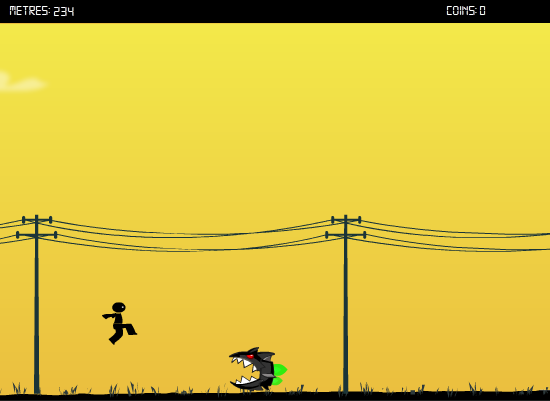
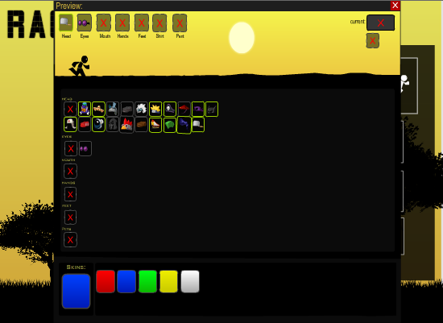
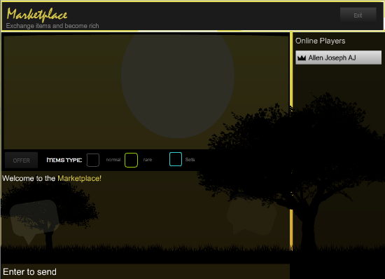

# Stick Run 
Stick Run is a 2D endless side-scroller game built with Marlin protocol. The player has to dodge and jump to avoid obstacles of two types (high and low ones) while collecting coins, so they have to either slide or jump. Gameplay in Stick Run is the simplest you can find in the genre: you can control your character using keyboard events. Players can spend their coins (or tokens) they win inside the marketplace to buy in-game items. The game uses a Facebook API to uniquely identify players. Marlin Protocol makes it possible for players in market-place to communicate efficiently with other players and trade items.

# PLAY

# INVENTORY

# MARKETPLACE (TRADE ITEMS HERE)

